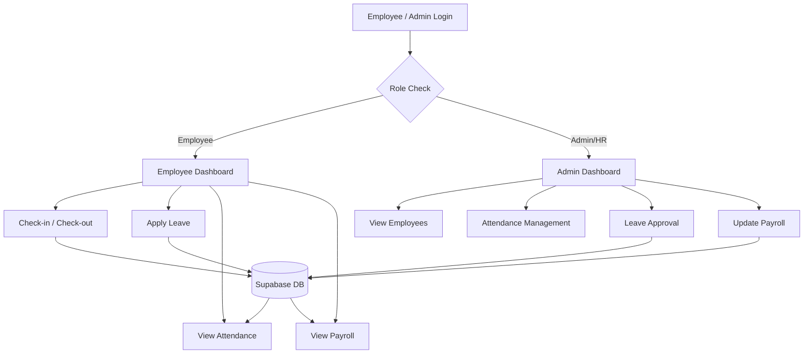
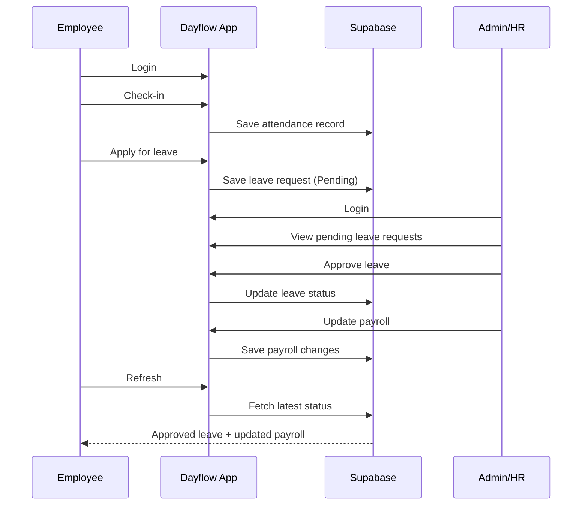
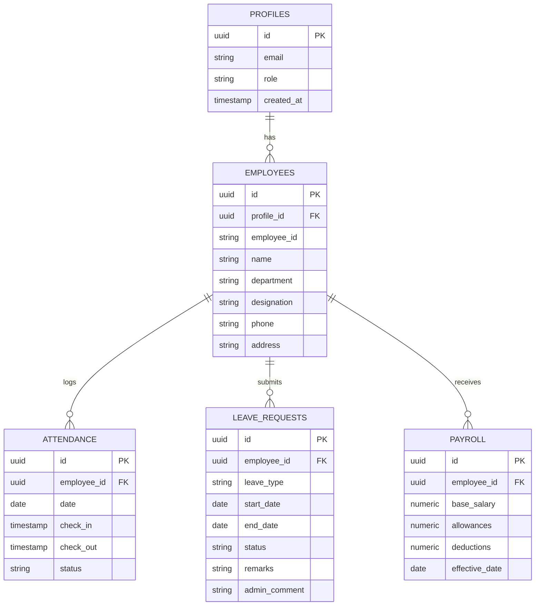

<p align="center">
  
</p>

<p align="center">
  
  
  
  
  
</p>

<p align="center">
  <b>A production-quality HRMS prototype</b> for Employee & Admin/HR workflows — authentication,
  attendance, leave management, and payroll, built end-to-end on Supabase.
</p>

<p align="center">
  <a href="#-live-demo">Live Demo</a> •
  <a href="#-features">Features</a> •
  <a href="#-architecture">Architecture</a> •
  <a href="#-database-schema">Database</a> •
  <a href="#-getting-started">Getting Started</a> •
  <a href="#-team">Team</a>
</p>

---

## 🔗 Live Demo

<p align="center">
  <a href="https://human-resource-manag-s0rp.bolt.host">
    
  </a>
  <a href="https://github.com/Mohithofficiall-commits/odoo-nmit-hackathon-2026/tree/main">
    
  </a>
</p>

**Demo credentials**

| Role | Email | Password |
|---|---|---|
| Employee | `employee@dayflow.demo` | `Demo@1234` |
| Admin/HR | `admin@dayflow.demo` | `Demo@1234` |

---

## ✨ Features

<details>
<summary><b>👤 Employee</b></summary>

- Dashboard — today's attendance status, check-in/check-out, working hours, leave balance, recent requests
- Profile — personal, job, and salary info; edit phone, address, and picture only
- Attendance — check-in/check-out that persists to the database; daily & weekly view
- Leave — apply (Paid/Sick/Unpaid), track status in real time
- Payroll — read-only view of salary structure

</details>

<details>
<summary><b>🛠️ Admin / HR</b></summary>

- Dashboard — headcount, present/absent today, on leave, pending requests
- Employees — search, filter, view, and edit employee records
- Attendance management — view all records with daily/weekly filters
- Leave approval — approve/reject with comments, reflects instantly for the employee
- Payroll — view and update salary structures across all employees

</details>

---

## 🏗️ Architecture



---

## 🔄 Demo Flow



---

## 🗄️ Database Schema



> Row Level Security is enforced so employees can only read/write their own records, while Admin/HR roles have elevated access for management operations.

---

## 🚀 Getting Started

<details>
<summary>Click to expand setup instructions</summary>

```bash
# 1. Clone the repo
git clone https://github.com/Mohithofficiall-commits/odoo-nmit-hackathon-2026.git
cd odoo-nmit-hackathon-2026

# 2. Install dependencies
npm install

# 3. Set up environment variables
cp .env.example .env
# Add your Supabase URL and anon key to .env

# 4. Run the app
npm run dev
```

</details>

---

## 🧰 Tech Stack

<p align="center">
  
  
  
  
  
</p>

---

## 👥 Team

<details>
<summary>Click to expand contributors</summary>

| Name | Role | GitHub |
|---|---|---|
| MOHITH L| Frontend | [@REPLACE_HANDLE_1](https://github.com/Mohithofficiall-commits) |
| KAVIN R| Backend | [@REPLACE_HANDLE_2](https://github.com/Kavin-124) |
| MOULITHARAN IR| Database | [@REPLACE_HANDLE_3](https://github.com/Moulitharan0107) |
| NAGARAJ V | UI/UX | [@REPLACE_HANDLE_4](https://github.com/nagarajvenkatachalam1-ctrl) |

</details>

---

<p align="center">
  <sub>Built with ❤️ for the Odoo Hackathon · <a href="LICENSE">MIT License</a></sub>
</p>
